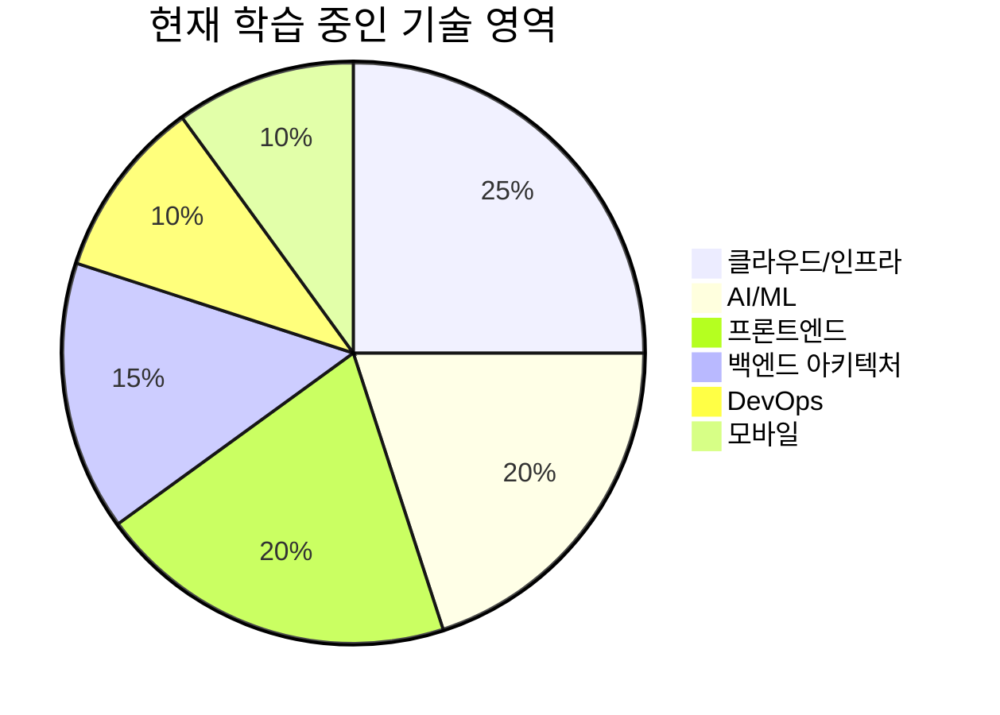

## 🔥 최근 활동

### 📝 최근 학습 노트
- [SAMPLE Vue 컴포넌트 라이프사이클 완벽 가이드](/notes/vue-component-lifecycle.md)
- [SAMPLE Spring Boot 마이크로서비스 아키텍처 설계 패턴](/notes/spring/)
- [SAMPLE AI 도구를 활용한 개발 생산성 향상 방법](/notes/ai/)

### 🎨 진행 중인 프로젝트
- **SAMPLE 마이크로서비스 전환**: 레거시 시스템을 현대적인 MSA로 전환 (진행률: 60%)
- **SAMPLE 학습 플랫폼 구축**: 개발자 교육을 위한 인터랙티브 플랫폼 개발
- **SAMPLE 오픈소스 기여**: Svelte 생태계 기여 및 새로운 도구 개발

### 📊 기술 관심도 차트

---

::: tip 연락하기
📧 **이메일**: [sample.email@example.com](mailto:sample.email@example.com)  
💼 **LinkedIn**: [linkedin.com/in/sampleprofile](https://linkedin.com/in/sampleprofile)  
🐱 **GitHub**: [github.com/sampleuser](https://github.com/sampleuser)  
📝 **기술 블로그**: [sampleblog.com](https://sampleblog.com)
:::

> "코드는 사람이 읽을 수 있도록 작성해야 한다. 기계가 실행할 수 있다는 것은 부차적인 일이다." - Martin Fowler