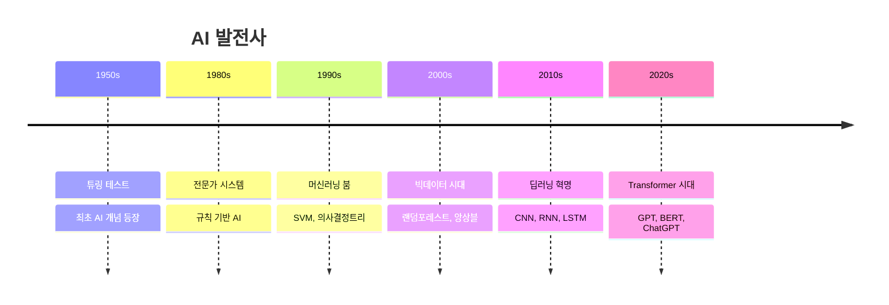

# 🤖 AI

인공지능과 머신러닝 관련 학습 내용들을 정리합니다.

## 목차

### 기초 개념
- [머신러닝 vs 딥러닝 vs AI](./ml-dl-ai.md)
- [지도학습 vs 비지도학습](./supervised-unsupervised.md)
- [모델 평가 지표](./evaluation-metrics.md)

### 딥러닝 프레임워크
- [TensorFlow 기초](./tensorflow-basics.md)
- [PyTorch 시작하기](./pytorch-getting-started.md)
- [Keras 활용법](./keras-usage.md)

### LLM & 생성형 AI
- [GPT 모델 이해하기](./understanding-gpt.md)
- [프롬프트 엔지니어링](./prompt-engineering.md)
- [RAG (Retrieval Augmented Generation)](./rag-system.md)

### 실무 활용
- [AI 개발 도구들](./ai-dev-tools.md)
- [모델 배포 전략](./model-deployment.md)
- [MLOps 구축하기](./mlops.md)

## AI 발전 타임라인

## 주요 AI 모델 비교

| 모델 타입 | 특징 | 주요 용도 | 예시 |
|----------|------|-----------|------|
| CNN | 이미지 패턴 인식 | 컴퓨터 비전 | ResNet, VGG |
| RNN | 순차 데이터 처리 | 자연어 처리 | LSTM, GRU |
| Transformer | 어텐션 메커니즘 | 언어 모델 | GPT, BERT |
| GAN | 생성 모델 | 이미지 생성 | StyleGAN, DCGAN |

::: warning 주의사항
AI 모델 사용 시 편향성과 윤리적 고려사항을 항상 염두에 두어야 합니다.
:::

---

> AI는 도구입니다. 중요한 것은 이를 어떻게 활용하느냐입니다.