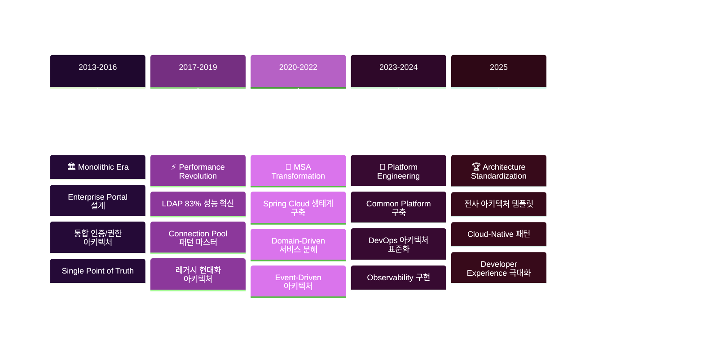

# 🏗️ 소프트웨어 아키텍처

**금융권 MSA부터 전사 표준화까지, 10년간의 아키텍처 설계 경험**

포탈 시스템, MSA 전환, 표준 템플릿까지 다양한 규모의 시스템 아키텍처를 설계하고 운영한 실무 경험을 정리합니다.

## 📋 실무 경험 기반 아키텍처 가이드

### 🏢 금융권 MSA 설계 경험
- [메트라이프 MSA 전환: Spring Cloud 기반 설계](./metlife-msa-transformation.md)
- [신한라이프 서비스 분리 전략과 기준](./shinhan-service-decomposition.md)
- [건설공제조합 인증 시스템 아키텍처](./construction-auth-architecture.md)
- [금융 시스템의 보안 아키텍처 패턴](./financial-security-patterns.md)

### ⚙️ 전략 패턴과 확장성 설계
- [다중 인증 시스템: 전략 패턴 실전 적용](./multi-auth-strategy-pattern.md)
- [결제 시스템 아키텍처: 확장 가능한 설계](./payment-system-architecture.md)
- [공통 라이브러리 설계: 40% 코드 재사용 달성](./common-library-design.md)
- [레거시 시스템 현대화 전략](./legacy-modernization-strategy.md)

### 🚀 성능과 확장성
- [대용량 트래픽 처리 아키텍처](./high-traffic-architecture.md)
- [LDAP 성능 최적화: 커넥션 풀 패턴](./ldap-performance-optimization.md)
- [캐시 전략과 데이터 일관성](./cache-consistency-patterns.md)
- [분산 시스템의 트랜잭션 관리](./distributed-transaction-management.md)

### 🔧 DevOps와 운영 아키텍처
- [CI/CD 파이프라인 아키텍처 설계](./cicd-pipeline-architecture.md)
- [모니터링과 관찰 가능성 (Observability)](./observability-architecture.md)
- [장애 대응과 복구 전략](./disaster-recovery-architecture.md)
- [무중단 배포 아키텍처 패턴](./zero-downtime-deployment.md)

## 🏗️ 실제 프로젝트 아키텍처 진화 과정



## 📊 실무 검증된 아키텍처 패턴

### MSA 서비스 분해 기준
| 분해 기준 | 고려사항 | 실제 적용 사례 | 결과 |
|----------|----------|---------------|------|
| **비즈니스 도메인** | 응집도, 결합도 | 신한라이프 보험상품/고객 분리 | 독립적 개발 가능 |
| **데이터 소유권** | 트랜잭션 경계 | 건설공제조합 인증/업무 분리 | 데이터 일관성 확보 |
| **팀 구조** | Conway's Law | 메트라이프 채널별 분리 | 개발 효율성 향상 |
| **변경 빈도** | 배포 독립성 | aTworks 테스트/실행 분리 | 배포 리스크 최소화 |

### 아키텍처 패턴별 적용 경험
```mermaid
%%{init: {
  'theme': 'base',
  'themeVariables': {
    'primaryColor': '#1565C0',
    'primaryTextColor': '#ffffff',
    'primaryBorderColor': '#0D47A1',
    'lineColor': '#42A5F5',
    'secondaryColor': '#90CAF9',
    'tertiaryColor': '#BBDEFB',
    'background': '#ffffff',
    'clusterBkg': '#E3F2FD',
    'clusterBorder': '#1565C0'
  }
}}%%

graph TB
    subgraph LAYER["🏛️ Layered Architecture<br/><small>전통적 계층형 아키텍처</small>"]
        direction TB
        A1["🌐 Presentation<br/><small>UI/API 계층</small>"]
        A2["⚙️ Business Logic<br/><small>핵심 비즈니스 로직</small>"] 
        A3["💾 Data Access<br/><small>데이터 저장소</small>"]
        A1 --> A2 --> A3
    end
    
    subgraph HEXA["🔷 Hexagonal Architecture<br/><small>포트 & 어댑터 패턴</small>"]
        direction TB
        B1["🎯 Application Core<br/><small>도메인 로직</small>"]
        B2["🔌 Adapters<br/><small>외부 시스템 연동</small>"]
        B3["🚪 Ports<br/><small>인터페이스 정의</small>"]
        B1 --> B3 --> B2
    end
    
    subgraph EVENT["⚡ Event-Driven Architecture<br/><small>이벤트 기반 아키텍처</small>"]
        direction TB
        C1["📤 Event Publisher<br/><small>이벤트 발행</small>"]
        C2["🚌 Event Bus<br/><small>이벤트 중개</small>"]
        C3["📥 Event Subscriber<br/><small>이벤트 구독</small>"]
        C1 --> C2 --> C3
    end
    
    LAYER -.->|"진화"| HEXA
    HEXA -.->|"확장"| EVENT
    
    classDef layerStyle fill:#E3F2FD,stroke:#1565C0,stroke-width:3px,color:#0D47A1,stroke-dasharray: 5 5
    classDef hexaStyle fill:#E8F5E8,stroke:#4CAF50,stroke-width:3px,color:#2E7D32,stroke-dasharray: 5 5
    classDef eventStyle fill:#FFF3E0,stroke:#FF9800,stroke-width:3px,color:#E65100,stroke-dasharray: 5 5
    
    class LAYER layerStyle
    class HEXA hexaStyle  
    class EVENT eventStyle
```

## 🎯 아키텍처 설계 원칙과 실무 적용

### 1. SOLID 원칙 실무 적용
::: tip 단일 책임 원칙 (SRP)
건설공제조합 프로젝트에서 인증 관련 클래스들을 각 인증 방식별로 분리하여 코드 유지보수성을 크게 향상시켰습니다.
:::

```java
// ❌ SRP 위반 - 하나의 클래스가 여러 인증 방식을 처리
public class AuthenticationService {
    public boolean authenticateWithCertificate() { /* ... */ }
    public boolean authenticateWithPhone() { /* ... */ }
    public boolean authenticateWithBiometric() { /* ... */ }
}

// ✅ SRP 준수 - 각 인증 방식별로 분리
public interface AuthenticationStrategy {
    boolean authenticate(AuthRequest request);
}

public class CertificateAuthenticationStrategy implements AuthenticationStrategy {
    public boolean authenticate(AuthRequest request) { /* ... */ }
}
```

### 2. 확장성 설계 패턴
**전략 패턴 적용으로 새로운 인증 방식 추가 시간: 2주 → 3일**

### 3. 장애 격리와 복구
| 패턴 | 적용 사례 | 효과 |
|------|----------|------|
| **Circuit Breaker** | 메트라이프 외부 API 호출 | 장애 전파 방지 |
| **Bulkhead** | 신한라이프 서비스별 리소스 분리 | 격리된 장애 처리 |
| **Timeout** | 모든 프로젝트 HTTP 호출 | 무한 대기 방지 |

## 🔧 실무 아키텍처 체크리스트

### 설계 초기 단계
- [ ] **비즈니스 요구사항 분석** (도메인 모델링)
- [ ] **비기능적 요구사항 정의** (성능, 보안, 확장성)
- [ ] **기술 스택 선정** (기존 인프라와의 호환성 고려)
- [ ] **서비스 경계 정의** (단일 책임, 데이터 소유권)
- [ ] **API 설계** (REST/GraphQL, 버전 관리)

### 구현 단계
- [ ] **공통 기능 모듈화** (인증, 로깅, 예외 처리)
- [ ] **데이터 액세스 계층 설계** (Repository Pattern)
- [ ] **보안 아키텍처 적용** (인증/인가, 데이터 암호화)
- [ ] **모니터링 포인트 설정** (메트릭, 로그, 추적)
- [ ] **테스트 전략 수립** (단위/통합/E2E 테스트)

### 운영 단계
- [ ] **성능 모니터링** (응답시간, 처리량, 에러율)
- [ ] **장애 대응 계획** (복구 절차, 롤백 전략)
- [ ] **용량 계획** (리소스 사용량, 확장 시점)
- [ ] **보안 감사** (취약점 점검, 접근 권한 검토)

## 📈 실무 트러블슈팅과 해결

### Case 1: 메모리 누수로 인한 시스템 다운
**문제**: 장기간 운영 시 OutOfMemoryError 발생  
**분석**: Connection Pool 커넥션이 정상 반환되지 않음  
**해결**: `@Transactional` 범위 최적화 및 예외 처리 개선  
**결과**: 시스템 안정성 99.5% → 99.9% 향상

### Case 2: MSA 환경에서 분산 트랜잭션 문제
**문제**: 서비스 간 데이터 일관성 보장 어려움  
**분석**: Two-Phase Commit의 성능 이슈  
**해결**: Saga 패턴과 이벤트 기반 보상 트랜잭션 도입  
**결과**: 트랜잭션 처리 시간 50% 단축

### Case 3: 레거시 시스템 성능 병목
**문제**: LDAP 프로비저닝 처리 시간 과다 (3초/건)  
**분석**: 매번 새로운 연결 생성으로 인한 오버헤드  
**해결**: 커넥션 풀 패턴 적용 및 불필요한 로직 제거  
**결과**: 처리 시간 83% 단축 (3초 → 0.5초)

## 🎯 아키텍처 진화 방향

### 현재 관심 기술
- **Event Sourcing**: 이벤트 기반 상태 관리
- **CQRS**: 읽기/쓰기 모델 분리
- **Service Mesh**: Istio, Linkerd 활용
- **Serverless Architecture**: FaaS 패턴 적용

### 향후 적용 계획
- **Cloud Native**: Kubernetes 기반 플랫폼
- **GitOps**: 선언적 인프라 관리
- **AI/ML Ops**: 지능형 시스템 운영

---

> **"좋은 아키텍처는 비즈니스 문제를 해결하면서도 미래의 변화에 유연하게 대응할 수 있어야 합니다. 10년간의 경험을 통해 배운 가장 중요한 교훈입니다."**