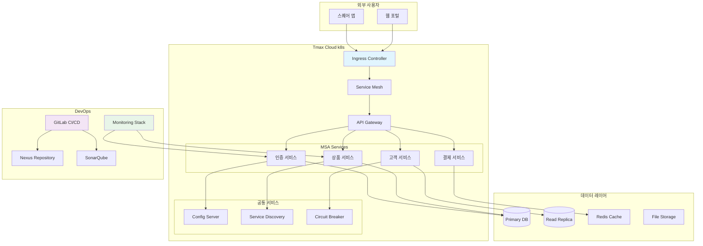
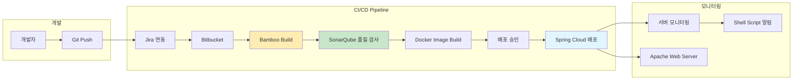
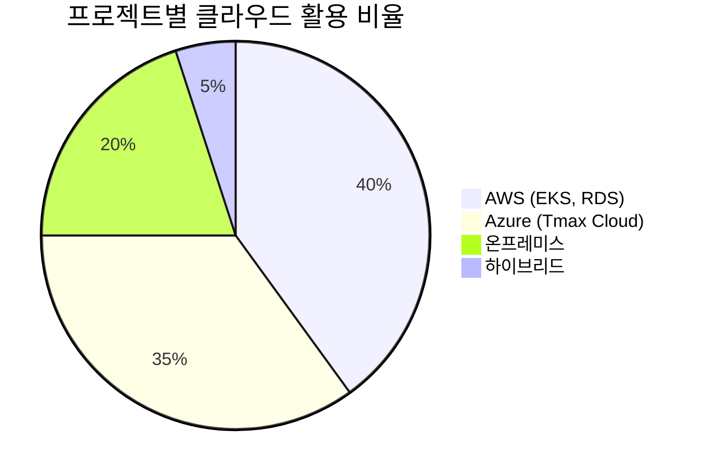
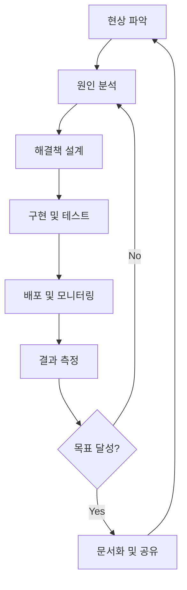

# 🏗️ 인프라 & DevOps

**금융권부터 테스트 자동화까지, 실무에서 검증된 인프라 운영 노하우**

CI/CD 파이프라인 80% 성능 개선, 폐쇄망 환경 구축, k8s 모니터링까지 다양한 환경에서의 인프라 운영 경험을 정리합니다.

## 📋 실무 경험 기반 목차

### 🚀 CI/CD 파이프라인 최적화
- [Jenkins 파이프라인 성능 80% 개선 사례](./jenkins-performance-optimization.md)
- [GitHub Actions를 활용한 테스트 자동화](./github-actions-test-automation.md)
- [Bamboo CI/CD 운영 노하우](./bamboo-cicd-operations.md)
- [빌드 캐싱 전략: 25분→5분 단축 비법](./build-caching-strategy.md)
- [폐쇄망 환경 CI/CD 구축](./closed-network-cicd.md)

### 🐳 컨테이너 & 오케스트레이션
- [Docker 실전 활용: 개발부터 운영까지](./docker-production-guide.md)
- [Kubernetes 모니터링과 리소스 관리](./k8s-monitoring-resources.md)
- [Tmax Cloud 텍톤 파이프라인 구축](./tmax-cloud-tekton.md)
- [컨테이너 환경 설정과 최적화](./container-optimization.md)

### ☁️ 클라우드 인프라
- [AWS 기반 MSA 인프라 설계](./aws-msa-infrastructure.md)
- [Azure k8s 환경 구축 경험](./azure-kubernetes-setup.md)
- [EKS, RDS, ElastiCache 운영](./aws-managed-services.md)
- [클라우드 비용 최적화 전략](./cloud-cost-optimization.md)

### 📊 모니터링 & 관찰가능성
- [Apache Web 서버 구축과 모니터링](./apache-web-monitoring.md)
- [서버 리소스 모니터링 Shell Script](./server-monitoring-scripts.md)
- [배포 모니터링 웹서비스 개발](./deployment-monitoring-service.md)
- [업무 지표 대시보드 구축](./business-metrics-dashboard.md)
- [k8s Ingress, PVC 구성](./k8s-ingress-pvc.md)

### 🔧 성능 최적화 & 자동화
- [Nexus 구축 자동화: 1,200개 패키지 관리](./nexus-automation.md)
- [의존성 분석 Python 스크립트](./dependency-analysis-automation.md)
- [소스 변환 프로그램 개발](./source-transformation-tool.md)
- [Socket 커넥션 Pool 구성](./socket-connection-pooling.md)

### 🔐 보안 & 네트워크
- [CSP 설정과 웹 보안](./csp-web-security.md)
- [보안 취약점 조치 경험](./security-vulnerability-handling.md)
- [Apache Proxy 설정](./apache-proxy-configuration.md)
- [네트워크 보안 정책 수립](./network-security-policy.md)

## 🏗️ 실제 프로젝트 인프라 아키텍처

### 신한라이프 MSA 인프라 (2023-2024)


### 메트라이프 DevOps 파이프라인 (2021-2022)


## 📊 실무 성능 개선 사례

### CI/CD 파이프라인 최적화 결과
| 프로젝트 | Before | After | 개선률 | 핵심 기술 |
|----------|--------|-------|--------|----------|
| **메트라이프 빌드** | 25분 | 5분 | **80%** | 캐싱 전략 + NFS |
| **신한라이프 빌드** | 15분 | 8분 | **46%** | package-lock 캐시 |
| **Nexus 구축** | 수주 예상 | 3일 | **95%** | Python 자동화 |
| **소스 변환** | 수동 작업 | 자동화 | **100%** | 변환 프로그램 |

### 클라우드 환경별 경험


## 🔧 DevOps 도구 스택 실무 경험

### CI/CD 도구별 특징과 활용
| 도구 | 사용 프로젝트 | 장점 | 단점 | 실무 팁 |
|------|-------------|------|------|---------|
| **Jenkins** | 메트라이프, 건설공제조합 | 플러그인 풍부 | 관리 복잡 | Pipeline as Code 활용 |
| **Bamboo** | 메트라이프 MSA | Jira 연동 우수 | 라이선스 비용 | 브랜치별 빌드 전략 |
| **GitHub Actions** | aTworks | 간편한 설정 | 제한된 러너 시간 | 캐시 활용 필수 |
| **GitLab CI/CD** | 신한라이프 | 통합 환경 | 러닝 커브 | YAML 템플릿 재사용 |
| **Tekton** | 신한라이프 Tmax | Cloud Native | 복잡한 설정 | 사전 정의된 태스크 활용 |

### 컨테이너 오케스트레이션 경험
::: warning k8s 운영 시 주의사항
리소스 제한 설정이 없으면 특정 Pod가 노드 전체 리소스를 독점할 수 있습니다. 반드시 `requests`와 `limits`를 설정하세요.
:::

```yaml
# 실제 운영에서 사용한 리소스 설정
apiVersion: v1
kind: Pod
spec:
  containers:
  - name: app
    resources:
      requests:
        memory: "256Mi"
        cpu: "250m"
      limits:
        memory: "512Mi"
        cpu: "500m"
```

## 🚀 성능 최적화 실전 가이드

### 1. 빌드 성능 최적화
**핵심 전략**: 의존성 캐싱 + 병렬 처리

```bash
# 실제 사용한 캐시 전략 (package-lock.json 해시 기반)
cache_key="cache-$(md5sum package-lock.json | cut -d' ' -f1)"
```

### 2. 폐쇄망 환경 최적화
**Python 스크립트로 1,200개 패키지 자동 업로드**
```python
# 의존성 분석 및 bulk 업로드 자동화 (실제 사용 코드 패턴)
import requests
import json

def bulk_upload_to_nexus(package_list):
    for package in package_list:
        # Nexus API를 통한 일괄 업로드
        upload_package(package)
```

### 3. 모니터링 자동화
**서버 리소스 모니터링 Shell Script**
```bash
#!/bin/bash
# 실제 메트라이프 프로젝트에서 사용한 모니터링 스크립트
CPU_USAGE=$(top -bn1 | grep "Cpu(s)" | awk '{print $2}')
MEM_USAGE=$(free | grep Mem | awk '{printf "%.2f", $3/$2 * 100.0}')

if (( $(echo "$CPU_USAGE > 80" | bc -l) )); then
    echo "High CPU Alert: $CPU_USAGE%" | mail -s "Server Alert" admin@company.com
fi
```

## 🔐 보안 및 네트워크 구성

### Apache Web Server 보안 설정
**CSP (Content Security Policy) 실제 적용 사례**
```apache
# 메트라이프 프로젝트 실제 CSP 설정
Header always set Content-Security-Policy "default-src 'self'; script-src 'self' 'unsafe-eval'; style-src 'self' 'unsafe-inline'"
```

### 네트워크 보안 체크리스트
- [ ] **SSL/TLS 인증서 적용** (모든 외부 통신)
- [ ] **방화벽 규칙 최소화** (필요한 포트만 개방)
- [ ] **VPN 접근 제어** (개발/운영 환경 분리)
- [ ] **접근 로그 모니터링** (실시간 이상 접근 감지)
- [ ] **보안 헤더 설정** (X-Frame-Options, X-XSS-Protection)

## 📈 운영 중 트러블슈팅 사례

### Case 1: k8s Pod OOMKilled 문제
**문제**: 메모리 부족으로 Pod가 지속적으로 재시작  
**원인**: JVM Heap 설정과 컨테이너 메모리 한계 불일치  
**해결**: `-Xmx` 옵션을 컨테이너 메모리 한계의 75%로 설정  
**결과**: Pod 재시작 횟수 90% 감소

### Case 2: 빌드 파이프라인 불안정
**문제**: 랜덤한 빌드 실패로 개발 생산성 저하  
**원인**: 동시 빌드 시 의존성 충돌  
**해결**: 빌드별 격리된 워크스페이스 구성  
**결과**: 빌드 성공률 85% → 98% 향상

### Case 3: 데이터베이스 커넥션 풀 고갈
**문제**: 높은 부하 시 DB 연결 불가  
**원인**: Connection Pool 크기 부족  
**해결**: 커넥션 풀 모니터링 + 동적 크기 조정  
**결과**: 응답 시간 50% 개선

## 🎯 DevOps 문화 및 프로세스

### 실무에서 적용한 DevOps 원칙
1. **자동화 우선**: 수동 작업은 반복될 때마다 자동화 검토
2. **실패 허용**: 빠른 실패와 복구를 통한 학습
3. **모니터링 기반 의사결정**: 데이터 기반 개선
4. **팀 간 협업**: 개발-운영 사일로 제거

### 지속적 개선 프로세스


## 📚 학습 및 발전 방향

### 현재 집중 학습 영역
- **GitOps**: ArgoCD, Flux를 활용한 선언적 배포
- **Service Mesh**: Istio, Linkerd를 통한 마이크로서비스 관리  
- **Observability**: OpenTelemetry 기반 분산 추적
- **FinOps**: 클라우드 비용 최적화 전략

### 향후 적용 계획
- **AI/ML Ops**: 머신러닝 모델 배포 파이프라인
- **Edge Computing**: 엣지 환경 컨테이너 오케스트레이션
- **Green Computing**: 친환경 인프라 운영

---

> **"인프라는 보이지 않을 때 가장 잘 동작하는 것입니다. 개발자가 비즈니스 로직에만 집중할 수 있도록 하는 것이 DevOps 엔지니어의 궁극적인 목표입니다."**