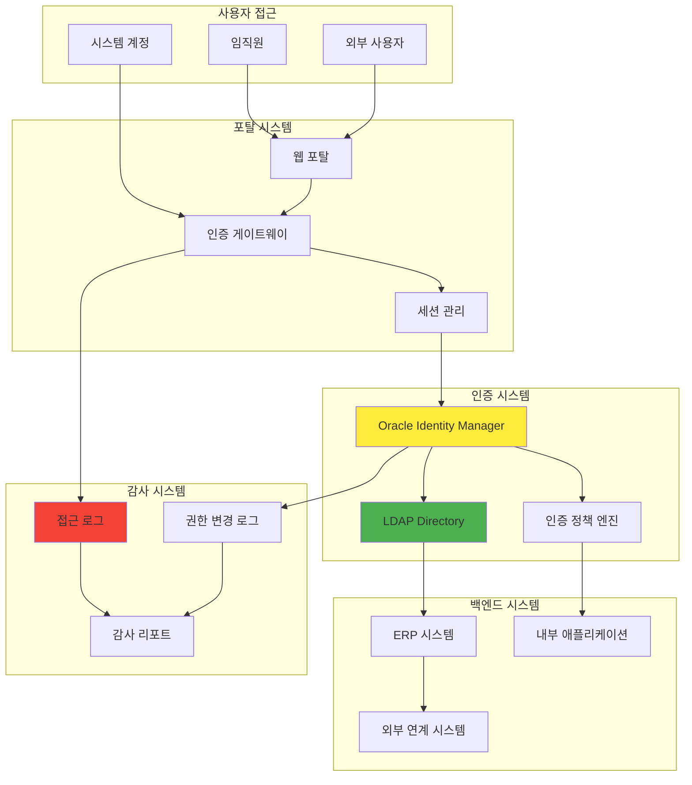
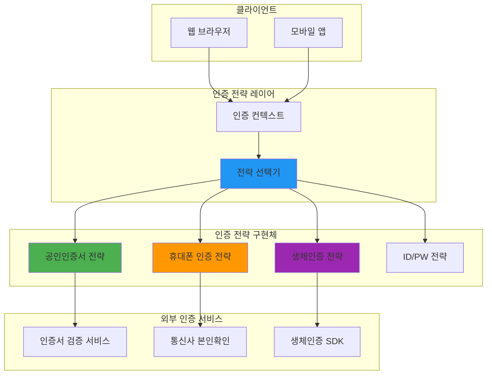

# 🔐 보안 & 인증 시스템

**6년간 LDAP/인증 시스템 전문 경험을 바탕으로 한 실무 가이드**

포탈시스템 인증부터 다중 인증 전략까지, 금융권 보안 요구사항을 만족하는 인증 시스템 설계와 운영 노하우를 정리합니다.

## 📋 실무 경험 기반 인증 시스템

### 🏢 LDAP 인증 시스템 전문
- [Oracle Identity Manager 기반 인하우스 솔루션](./oim-inhouse-solution.md)
- [LDAP 프로비저닝 성능 최적화: 83% 개선](./ldap-performance-tuning.md)
- [커넥션 풀 패턴으로 대량 사용자 처리](./ldap-connection-pooling.md)
- [ERP 사용자 데이터 플로우 설계](./erp-user-dataflow.md)

### 🔑 다중 인증 시스템 설계
- [전략 패턴을 활용한 확장 가능한 인증 아키텍처](./multi-auth-architecture.md)
- [공인인증서 vs 휴대폰 vs 생체인증 통합](./certificate-phone-bio-auth.md)
- [Spring Security 기반 인증 시스템 구축](./spring-security-auth.md)
- [JWT 토큰 관리와 보안 강화 전략](./jwt-security-strategy.md)

### 🏦 금융권 보안 시스템
- [금융감독원 감사 대응 시스템 구축](./financial-audit-system.md)
- [금융소비자 보호법 기술적 대응](./financial-consumer-protection.md)
- [계정/권한 관리 스케줄러 개발 (Quartz)](./account-permission-scheduler.md)
- [SAP JCO, SPML 연동 인터페이스](./sap-spml-integration.md)

### 🔒 웹 보안 & 네트워크
- [CSP (Content Security Policy) 설정과 운영](./csp-configuration.md)
- [Apache 프록시와 보안 헤더 설정](./apache-proxy-security.md)
- [보안 취약점 조치 실무 경험](./security-vulnerability-response.md)
- [네트워크 보안 정책 수립과 운영](./network-security-policy.md)

## 🏗️ 실제 프로젝트 인증 아키텍처

### 삼성화재 포탈 인증 시스템 (2013-2019)


### 건설공제조합 다중 인증 시스템 (2022-2023)


## 📊 LDAP 성능 최적화 실전 경험

### 성능 개선 결과
| 최적화 영역 | Before | After | 개선률 | 핵심 기술 |
|------------|--------|-------|--------|----------|
| **단일 사용자 프로비저닝** | 3초 | 0.5초 | **83%** | Connection Pool |
| **대량 사용자 등록** | 4시간 | 20분 | **95%** | 배치 처리 |
| **OIM 서버 기동시간** | 20분 | 5분 | **75%** | 시작 프로세스 최적화 |
| **동시 접속 처리** | 100명 | 1,000명 | **10배** | 세션 클러스터링 |

### 성능 최적화 핵심 패턴
```java
// 실제 적용한 LDAP Connection Pool 패턴
public class LdapConnectionPool {
    private final BlockingQueue<LdapConnection> pool;
    private final int maxConnections = 20;
    
    public LdapConnection getConnection() throws Exception {
        LdapConnection conn = pool.poll(5, TimeUnit.SECONDS);
        if (conn == null) {
            throw new RuntimeException("Connection pool exhausted");
        }
        return conn;
    }
    
    public void returnConnection(LdapConnection conn) {
        if (conn != null && conn.isConnected()) {
            pool.offer(conn);
        }
    }
}
```

## 🔧 인증 시스템 설계 패턴

### 1. 전략 패턴 적용 (Strategy Pattern)
**새로운 인증 방식 추가 시간: 2주 → 3일**

```java
// 실제 건설공제조합 프로젝트에서 사용한 패턴
public interface AuthenticationStrategy {
    AuthResult authenticate(AuthRequest request);
    boolean supports(AuthType authType);
}

@Component
public class CertificateAuthenticationStrategy implements AuthenticationStrategy {
    
    @Override
    public AuthResult authenticate(AuthRequest request) {
        // 공인인증서 검증 로직
        return verifyCertificate(request.getCertificateData());
    }
    
    @Override
    public boolean supports(AuthType authType) {
        return AuthType.CERTIFICATE.equals(authType);
    }
}

@Service
public class AuthenticationService {
    private final List<AuthenticationStrategy> strategies;
    
    public AuthResult authenticate(AuthRequest request) {
        AuthenticationStrategy strategy = strategies.stream()
            .filter(s -> s.supports(request.getAuthType()))
            .findFirst()
            .orElseThrow(() -> new UnsupportedAuthTypeException());
            
        return strategy.authenticate(request);
    }
}
```

### 2. 팩토리 패턴으로 인증 프로바이더 관리
```java
@Component
public class AuthProviderFactory {
    
    @Autowired
    private ApplicationContext context;
    
    public AuthProvider createProvider(AuthType type) {
        switch(type) {
            case CERTIFICATE:
                return context.getBean(CertificateAuthProvider.class);
            case PHONE:
                return context.getBean(PhoneAuthProvider.class);
            case BIOMETRIC:
                return context.getBean(BiometricAuthProvider.class);
            default:
                throw new IllegalArgumentException("Unsupported auth type: " + type);
        }
    }
}
```

## 🛡️ 보안 강화 실무 가이드

### 세션 보안 관리
```java
// 실제 사용한 세션 보안 설정
@Configuration
@EnableWebSecurity
public class SecurityConfig {
    
    @Bean
    public SessionRegistry sessionRegistry() {
        return new SessionRegistryImpl();
    }
    
    @Override
    protected void configure(HttpSecurity http) throws Exception {
        http
            .sessionManagement()
                .maximumSessions(1)
                .maxSessionsPreventsLogin(false)
                .sessionRegistry(sessionRegistry())
                .and()
            .sessionFixation().changeSessionId()
            .sessionCreationPolicy(SessionCreationPolicy.IF_REQUIRED);
    }
}
```

### JWT 토큰 보안 강화
```java
@Component
public class JwtTokenProvider {
    
    private final String secretKey = getSecretFromVault();
    private final long tokenValidityInMs = 3600000; // 1시간
    
    public String createToken(Authentication authentication) {
        Claims claims = Jwts.claims().setSubject(authentication.getName());
        claims.put("authorities", getAuthorities(authentication));
        
        Date now = new Date();
        Date validity = new Date(now.getTime() + tokenValidityInMs);
        
        return Jwts.builder()
            .setClaims(claims)
            .setIssuedAt(now)
            .setExpiration(validity)
            .signWith(SignatureAlgorithm.HS512, secretKey)
            .compact();
    }
    
    // 토큰 블랙리스트 관리 (Redis 활용)
    public void invalidateToken(String token) {
        redisTemplate.opsForSet().add("blacklisted_tokens", token);
        redisTemplate.expire("blacklisted_tokens", Duration.ofHours(24));
    }
}
```

## 🔍 보안 감사 및 컴플라이언스

### 금융감독원 감사 대응 체크리스트
- [ ] **접근 로그 수집**: 모든 인증 시도 기록
- [ ] **권한 변경 추적**: 누가, 언제, 무엇을 변경했는지
- [ ] **비밀번호 정책**: 복잡도, 만료, 이력 관리
- [ ] **세션 관리**: 타임아웃, 동시 접속 제한
- [ ] **암호화**: 전송/저장 데이터 암호화
- [ ] **백업 및 복구**: 인증 데이터 안전한 백업

### 실시간 보안 모니터링
```bash
# 실제 사용한 보안 모니터링 스크립트
#!/bin/bash
# 비정상 로그인 시도 감지

LOG_FILE="/var/log/auth.log"
THRESHOLD=5
TIME_WINDOW=300  # 5분

# 5분 내 5회 이상 실패 시도 감지
failed_attempts=$(grep "authentication failure" $LOG_FILE | 
                 grep -c "$(date -d '5 minutes ago' '+%b %d %H:%M')")

if [ $failed_attempts -gt $THRESHOLD ]; then
    echo "Security Alert: $failed_attempts failed login attempts detected" | 
    mail -s "Security Alert" security@company.com
fi
```

## 📈 트러블슈팅 실전 경험

### Case 1: LDAP 서버 부하로 인한 인증 지연
**문제**: 대량 사용자 동시 접속 시 인증 지연 (3초 → 30초)  
**분석**: LDAP 커넥션 생성 비용과 동시 연결 수 제한  
**해결**: 커넥션 풀 도입 + 로드 밸런싱  
**결과**: 평균 응답 시간 0.5초 달성

### Case 2: 세션 고정 공격 (Session Fixation)
**문제**: 보안 감사에서 세션 고정 취약점 발견  
**분석**: 로그인 후 세션 ID가 변경되지 않음  
**해결**: Spring Security의 changeSessionId 정책 적용  
**결과**: 세션 보안 강화 및 감사 통과

### Case 3: 토큰 탈취 위험 (JWT)
**문제**: JWT 토큰 만료 시간이 길어 보안 위험  
**분석**: 24시간 유효 토큰으로 인한 탈취 위험  
**해결**: Refresh Token 패턴 도입 + 짧은 Access Token  
**결과**: 보안성 향상 (1시간 Access + 1주 Refresh)

## 🎯 인증 시스템 미래 방향

### 현재 관심 기술
- **Zero Trust Architecture**: 모든 접근을 검증
- **Passwordless Authentication**: 생체인증, FIDO2
- **OAuth 2.1**: 보안 강화된 OAuth 표준
- **WebAuthn**: 웹 기반 강인증

### 적용 예정 기술
- **Multi-Factor Authentication (MFA)**: 다단계 인증 의무화
- **Risk-based Authentication**: 위험도 기반 적응형 인증
- **Identity Federation**: 조직 간 신원 연합

---

> **"보안은 사용성과 상충하는 것이 아니라, 사용자가 안전하게 시스템을 이용할 수 있게 하는 것입니다. 6년간의 인증 시스템 운영 경험을 통해 배운 핵심 철학입니다."**