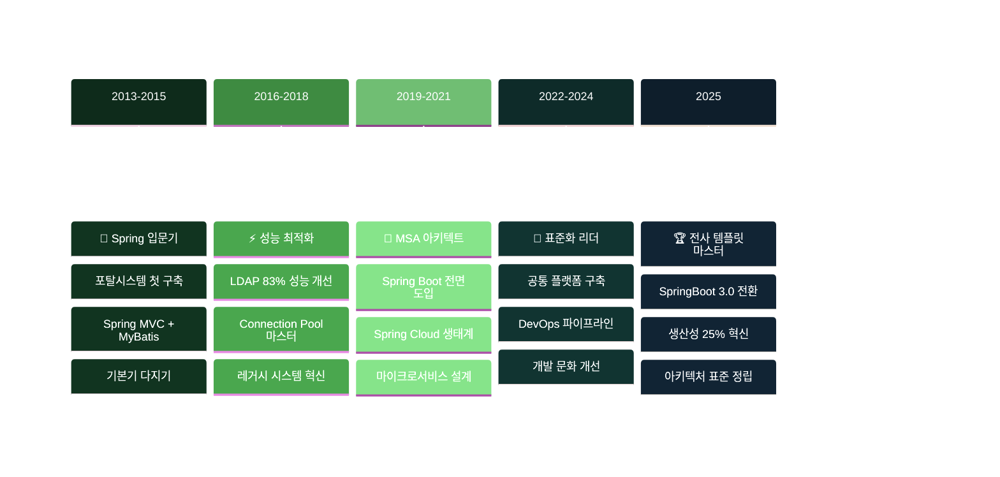

# 🍃 Spring Framework

**10년+ 실무 경험을 바탕으로 한 Spring 생태계 완전 정복**

금융권 시스템부터 전사 표준 템플릿까지, 다양한 프로젝트에서 축적한 Spring Framework 전문 지식을 정리합니다.

## 📋 실무 경험 기반 목차

### 🏗️ Spring Core & 아키텍처 설계
- [IoC/DI 실무 패턴과 함정들](./ioc-di-production.md)
- [Bean 생명주기 관리와 성능 최적화](./bean-lifecycle-optimization.md)
- [AOP를 활용한 횡단 관심사 처리](./aop-cross-cutting.md)
- [Spring 설정 전략: 환경별 구성 관리](./spring-configuration-strategy.md)

### 🚀 Spring Boot 실전 활용
- [표준 템플릿 설계: 개발 생산성 25% 향상 비법](./spring-boot-template.md)
- [공통 모듈 설계와 코드 재사용률 40% 달성](./common-module-design.md)
- [Auto Configuration 커스터마이징](./custom-auto-configuration.md)
- [Spring Boot 3.0 마이그레이션 가이드](./spring-boot-3-migration.md)
- [Actuator를 활용한 운영 모니터링](./actuator-monitoring.md)

### 🌐 Spring Cloud & MSA
- [금융권 MSA 아키텍처 설계 경험](./financial-msa-architecture.md)
- [Spring Cloud Gateway vs Zuul 실전 비교](./gateway-comparison.md)
- [Eureka Service Discovery 운영 노하우](./eureka-production.md)
- [Config Server를 통한 설정 중앙화](./config-server-centralization.md)
- [Circuit Breaker 패턴으로 장애 전파 방지](./circuit-breaker-pattern.md)

### 🔐 Spring Security 심화
- [다중 인증 시스템 설계: 전략 패턴 활용](./multi-auth-system.md)
- [JWT 토큰 관리와 보안 강화](./jwt-security-enhancement.md)
- [LDAP 연동 인증 시스템 구축](./ldap-authentication.md)
- [Method Security를 통한 세밀한 권한 제어](./method-security.md)
- [OAuth2와 생체인증 연동 경험](./oauth2-biometric.md)

### 📊 Spring Data & 성능 최적화
- [JPA 성능 튜닝: N+1 문제 완전 정복](./jpa-performance-tuning.md)
- [대용량 데이터 처리: 배치 최적화](./bulk-data-processing.md)
- [커넥션 풀 최적화로 성능 83% 개선](./connection-pool-optimization.md)
- [트랜잭션 관리 전략과 격리 수준](./transaction-management.md)

## 🏗️ 실무 프로젝트별 Spring 활용 경험



## 📊 실무에서 검증된 Spring 패턴

### 성능 최적화 경험
| 최적화 영역 | Before | After | 개선률 | 적용 기술 |
|------------|--------|-------|--------|----------|
| LDAP 프로비저닝 | 3초/건 | 0.5초/건 | **83%** | Connection Pool |
| 빌드 파이프라인 | 25분 | 5분 | **80%** | 캐싱 전략 |
| 프로젝트 초기화 | 2주 | 1주 | **50%** | 표준 템플릿 |
| 코드 재사용률 | - | 40%↑ | **40%** | 공통 모듈 |

### 아키텍처 패턴 적용 경험

```mermaid
%%{init: {
  'theme': 'base',
  'themeVariables': {
    'primaryColor': '#1976D2',
    'primaryTextColor': '#ffffff',
    'primaryBorderColor': '#0D47A1',
    'lineColor': '#2196F3',
    'secondaryColor': '#64B5F6',
    'tertiaryColor': '#BBDEFB',
    'background': '#ffffff',
    'clusterBkg': '#E3F2FD',
    'clusterBorder': '#1976D2',
    'edgeLabelBackground': '#ffffff'
  }
}}%%

flowchart TD
    subgraph SK["🏢 SK C&C 전사 표준"]
        direction TB
        A["📚 공통 라이브러리<br/>코드 재사용률 40%↑"]
        B["⚙️ 표준 설정<br/>프로젝트 초기화 50%↓"]
        C["📊 모니터링<br/>운영 가시성 확보"]
    end
    
    subgraph SH["🏦 신한라이프 MSA"]
        direction TB
        D["🔍 Service Discovery<br/>동적 서비스 탐색"]
        E["🔧 Config Server<br/>중앙화된 설정 관리"] 
        F["⚡ Circuit Breaker<br/>장애 전파 방지"]
    end
    
    subgraph KC["🏗️ 건설공제조합 인증"]
        direction TB
        G["🔐 다중 인증 전략<br/>확장 가능한 설계"]
        H["👥 권한 관리<br/>세밀한 접근 제어"]
        I["🔄 세션 클러스터링<br/>고가용성 확보"]
    end
    
    A -.->|"진화"| D
    B -.->|"적용"| E
    C -.->|"확장"| F
    D -.->|"통합"| G
    E -.->|"연동"| H
    F -.->|"최적화"| I
    
    classDef skStyle fill:#E3F2FD,stroke:#1976D2,stroke-width:3px,color:#0D47A1
    classDef shStyle fill:#E8F5E8,stroke:#4CAF50,stroke-width:3px,color:#2E7D32
    classDef kcStyle fill:#FFF3E0,stroke:#FF9800,stroke-width:3px,color:#E65100
    
    class SK skStyle
    class SH shStyle
    class KC kcStyle
```


## 🔧 실무 개발 가이드

### 1. 프로젝트 초기 설정 체크리스트
- [ ] **환경별 프로파일 구성** (dev, test, prod)
- [ ] **로깅 전략 수립** (ELK 스택 연동 고려)
- [ ] **DB 커넥션 풀 최적화** (HikariCP 설정)
- [ ] **보안 설정** (Spring Security 기본 구성)
- [ ] **모니터링 설정** (Actuator + Micrometer)

### 2. 공통 라이브러리 필수 요소
```java
// 실제 SK C&C 프로젝트에서 사용한 패턴
@Configuration
@EnableConfigurationProperties(CommonProperties.class)
public class CommonAutoConfiguration {
    
    @Bean
    @ConditionalOnMissingBean
    public AuthenticationService authService() {
        return new DefaultAuthenticationService();
    }
    
    @Bean
    public LoggingAspect loggingAspect() {
        return new LoggingAspect();
    }
}
```

### 3. MSA 환경 필수 구성
| 컴포넌트 | 용도 | 실무 노하우 |
|----------|------|-------------|
| **Eureka Server** | Service Discovery | 클러스터 구성 필수 |
| **Config Server** | 중앙 설정 관리 | Git Backend 사용 |
| **Gateway** | API 라우팅 | Rate Limiting 적용 |
| **Circuit Breaker** | 장애 전파 방지 | Hystrix → Resilience4j |

## ⚡ 성능 튜닝 실전 노하우

### JPA 최적화 핵심 포인트
::: warning N+1 쿼리 문제
실무에서 가장 빈번하게 발생하는 성능 문제입니다. `@EntityGraph`나 `Fetch Join`을 활용하여 해결하세요.
:::

```java
// ❌ N+1 문제 발생
public List<User> findAllUsers() {
    return userRepository.findAll(); // 각 User마다 추가 쿼리 발생
}

// ✅ 한 번에 조회
@Query("SELECT u FROM User u LEFT JOIN FETCH u.roles")
public List<User> findAllUsersWithRoles();
```

### 커넥션 풀 최적화 설정
```yaml
# 실무에서 검증된 HikariCP 설정
spring:
  datasource:
    hikari:
      maximum-pool-size: 20
      minimum-idle: 5
      idle-timeout: 300000
      max-lifetime: 1800000
      connection-test-query: SELECT 1
```

## 🎯 실무 트러블슈팅 케이스

### Case 1: Memory Leak 해결
**문제**: 장시간 운영 시 메모리 사용량이 계속 증가  
**원인**: Connection Pool에서 커넥션이 반환되지 않음  
**해결**: `@Transactional` 범위 최적화 및 예외 처리 개선

### Case 2: 동시성 문제
**문제**: 다중 스레드 환경에서 데이터 정합성 이슈  
**원인**: Singleton Bean에서 인스턴스 변수 사용  
**해결**: ThreadLocal 또는 Stateless 설계로 전환

### Case 3: 빌드 성능 최적화
**문제**: 테스트 실행 시간 과다 (25분)  
**원인**: 전체 ApplicationContext 로딩  
**해결**: `@WebMvcTest`, `@DataJpaTest` 등 슬라이스 테스트 활용

## 📚 지속적 학습 로드맵

### 현재 집중 학습 영역
- **Spring Native**: GraalVM 기반 네이티브 이미지
- **WebFlux**: 리액티브 프로그래밍 패러다임  
- **Spring AI**: LLM 통합 프레임워크
- **Virtual Threads**: Project Loom 활용

### 실무 적용 예정 기술
- **R2DBC**: 비동기 데이터베이스 액세스
- **GraphQL**: 유연한 API 설계
- **Testcontainers**: 통합 테스트 환경 개선

---

> **"10년간의 Spring 경험을 통해 배운 것은, 프레임워크는 도구일 뿐이고 진짜 중요한 건 비즈니스 문제를 해결하는 것이라는 점입니다."**