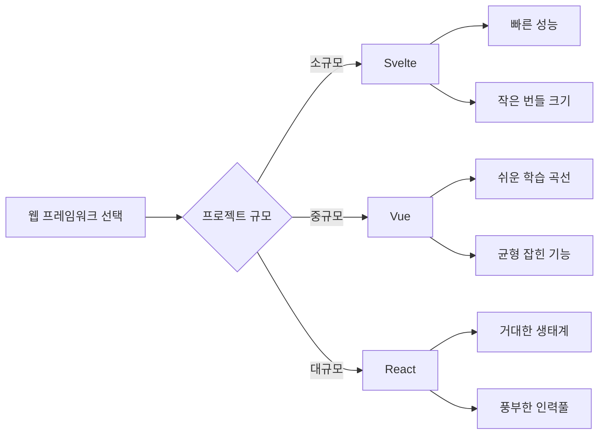
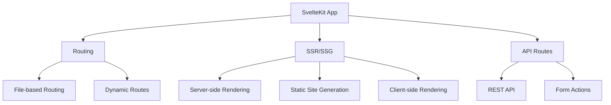

# ⚡ Svelte

Svelte 및 SvelteKit 관련 학습 내용들을 정리합니다.

## 목차

### Svelte 기초
- [Svelte 시작하기](./svelte-basics.md)
- [리액티브 선언](./reactivity.md)
- [컴포넌트 통신](./component-communication.md)

### 고급 기능
- [스토어 (Stores)](./stores.md)
- [애니메이션과 트랜지션](./animations-transitions.md)
- [액션 (Actions)](./actions.md)

### SvelteKit
- [SvelteKit 개요](./sveltekit-overview.md)
- [라우팅 시스템](./routing.md)
- [서버사이드 렌더링 (SSR)](./ssr.md)
- [API 라우트](./api-routes.md)

### 생태계 & 도구
- [Svelte 개발 도구](./dev-tools.md)
- [UI 컴포넌트 라이브러리](./ui-libraries.md)
- [상태 관리 솔루션](./state-management.md)

## Svelte vs React vs Vue



## 성능 비교 차트

| 프레임워크 | 런타임 성능 | 번들 크기 | 학습 난이도 | 생태계 |
|-----------|-------------|-----------|-------------|---------|
| Svelte | ⭐⭐⭐⭐⭐ | ⭐⭐⭐⭐⭐ | ⭐⭐⭐⭐ | ⭐⭐⭐ |
| React | ⭐⭐⭐⭐ | ⭐⭐⭐ | ⭐⭐⭐ | ⭐⭐⭐⭐⭐ |
| Vue | ⭐⭐⭐⭐ | ⭐⭐⭐⭐ | ⭐⭐⭐⭐⭐ | ⭐⭐⭐⭐ |

## Svelte 핵심 개념

### 리액티브 할당
```javascript
let count = 0;

// 자동으로 리액티브함
$: doubled = count * 2;

function increment() {
  count += 1; // 자동으로 UI 업데이트
}
```

### 컴파일 타임 최적화
- 가상 DOM 없음
- 작은 번들 사이즈
- 빠른 런타임 성능

::: tip Svelte의 장점
- **No Virtual DOM**: 컴파일 타임에 최적화된 바닐라 JS 생성
- **Less Boilerplate**: 더 적은 코드로 같은 기능 구현
- **Built-in State Management**: 별도 라이브러리 없이 상태 관리
:::

## SvelteKit 아키텍처



---

> Svelte는 '사라지는 프레임워크' - 컴파일 후에는 순수한 바닐라 JavaScript만 남습니다.