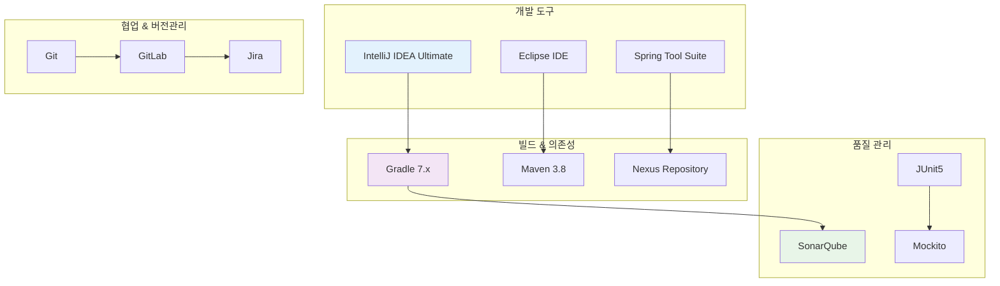
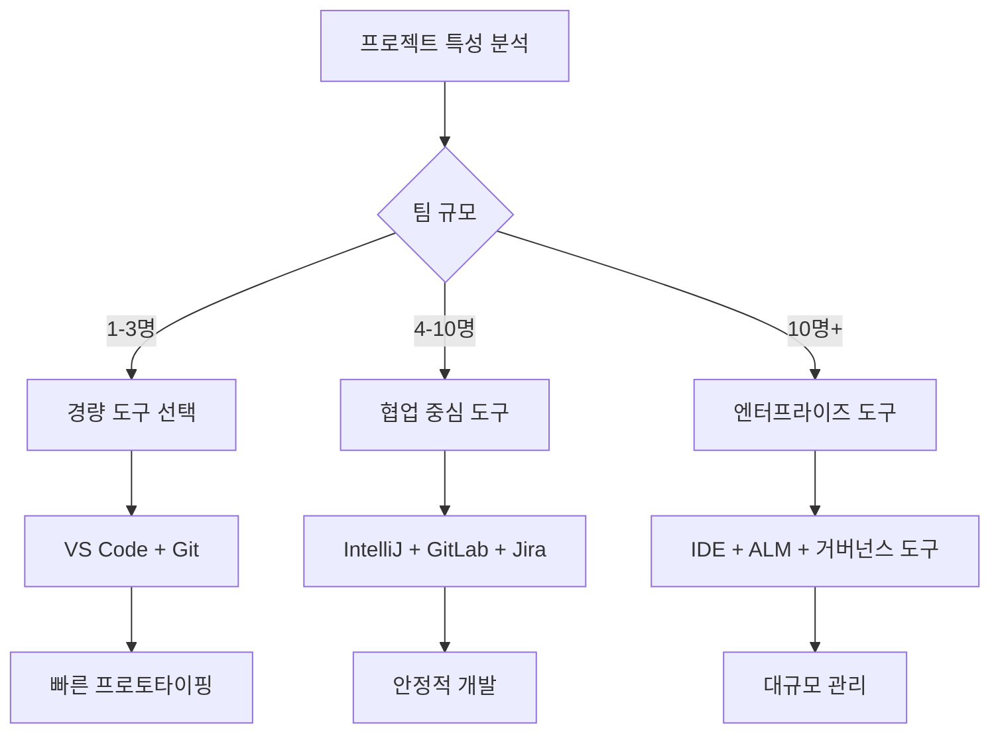

# 🛠️ 개발 도구 & 생산성

**10년간 실무에서 검증된 개발 도구와 워크플로우**

다양한 프로젝트 환경에서 생산성을 극대화한 도구 선택과 설정 노하우를 공유합니다.

## 📋 실무 검증된 도구 스택

### 💻 IDE & 개발 환경
- [IntelliJ IDEA 마스터 설정: 10년 노하우](./intellij-production-setup.md)
- [Eclipse 기반 개발 환경 (레거시 프로젝트)](./eclipse-legacy-setup.md)
- [VS Code Java 개발 설정 (경량화 필요시)](./vscode-java-setup.md)
- [개발환경 표준화를 통한 협업 효율 향상](./dev-env-standardization.md)

### 🔄 버전 관리 & 협업
- [Git 브랜치 전략: 금융권 프로젝트 적용 사례](./git-branching-financial.md)
- [GitLab 워크플로우 최적화](./gitlab-workflow-optimization.md)
- [Bitbucket과 Jira 연동 운영](./bitbucket-jira-integration.md)
- [코드 리뷰 문화 정착 경험](./code-review-culture.md)

### 🔨 빌드 & 의존성 관리
- [Gradle 멀티 프로젝트 구성 마스터](./gradle-multi-project.md)
- [Maven vs Gradle: 실무 관점 비교](./maven-gradle-comparison.md)
- [NPM vs Yarn vs PNPM: 프로젝트별 선택 기준](./package-managers-selection.md)
- [Nexus Repository 운영 노하우](./nexus-repository-management.md)

### 🧪 테스팅 & 품질 관리
- [JUnit5 실전 활용: TDD 적용 경험](./junit5-tdd-experience.md)
- [SonarQube 코드 품질 관리](./sonarqube-quality-management.md)
- [테스트 자동화 전략 수립](./test-automation-strategy.md)
- [성능 테스트 지원 도구 활용](./performance-testing-tools.md)

### 🚀 DevOps & 자동화
- [Jenkins Pipeline 최적화 실전](./jenkins-pipeline-optimization.md)
- [GitHub Actions 실무 활용법](./github-actions-production.md)
- [Bamboo CI/CD 운영 경험](./bamboo-cicd-experience.md)
- [Docker & Docker-Compose 활용](./docker-production-usage.md)

### 📊 모니터링 & 분석
- [APM 도구를 통한 성능 분석](./apm-performance-analysis.md)
- [로그 분석 도구 활용 (ELK Stack)](./log-analysis-elk.md)
- [개발 생산성 측정 도구](./dev-productivity-metrics.md)
- [시스템 모니터링 Shell Script](./system-monitoring-scripts.md)

## 🏗️ 프로젝트별 도구 스택 경험

### SK C&C 프로젝트 도구 스택


## 📊 실무 도구 선택 기준과 결과

### IDE 선택과 최적화 경험
| IDE | 사용 프로젝트 | 장점 | 단점 | 생산성 향상 |
|-----|-------------|------|------|-------------|
| **IntelliJ IDEA** | SK C&C 모든 프로젝트 | 강력한 리팩토링, 디버깅 | 메모리 사용량 | **40%** |
| **Eclipse** | 미라콤아이앤씨 레거시 | 플러그인 풍부, 무료 | 느린 속도 | **20%** |
| **VS Code** | 프론트엔드 작업 | 가벼움, 확장성 | Java 지원 한계 | **30%** |

### 빌드 도구 마이그레이션 경험
**Gradle 도입으로 빌드 시간 50% 단축**
```gradle
// 실제 사용한 Gradle 최적화 설정
gradle.properties:
org.gradle.daemon=true
org.gradle.parallel=true
org.gradle.caching=true
org.gradle.configureondemand=true
```

### 테스트 자동화 도구 적용 결과
| 도구 | 적용 프로젝트 | 테스트 커버리지 | 버그 감소율 |
|------|-------------|---------------|-------------|
| **JUnit5 + Mockito** | aTworks | 85% | 60% |
| **Spring Boot Test** | 신한라이프 | 78% | 45% |
| **Integration Test** | 건설공제조합 | 70% | 40% |

## 🔧 실무 도구 설정과 팁

### IntelliJ IDEA 마스터 설정
**10년간 축적된 생산성 설정**

```xml
<!-- 실제 사용 중인 Live Template 예시 -->
<template name="test" value="@Test&#10;public void $METHOD_NAME$() {&#10;    // Given&#10;    $GIVEN$&#10;    &#10;    // When&#10;    $WHEN$&#10;    &#10;    // Then&#10;    $THEN$&#10;}"/>
```

### Git 워크플로우 최적화
**금융권 프로젝트 브랜치 전략**
```bash
# 실제 사용한 Git Hook (commit-msg)
#!/bin/sh
# Jira 티켓 번호 자동 추가
commit_regex='^[A-Z]+-[0-9]+:'
if ! grep -qE "$commit_regex" "$1"; then
    echo "커밋 메시지는 JIRA-123: 형식으로 시작해야 합니다."
    exit 1
fi
```

### 코드 품질 관리 자동화
**SonarQube 품질 게이트 설정**
- **코드 커버리지**: 최소 80%
- **중복 코드**: 3% 이하
- **복잡도**: 함수당 최대 15
- **기술 부채**: A등급 유지

## 🚀 생산성 극대화 워크플로우

### 1. 코딩 표준화 도구
**CheckStyle + PMD + SpotBugs 조합**
```xml
<!-- 실제 사용하는 checkstyle.xml 핵심 설정 -->
<module name="LineLength">
    <property name="max" value="120"/>
</module>
<module name="MethodLength">
    <property name="max" value="50"/>
</module>
```

### 2. 자동화 스크립트 모음
**일일 업무 자동화**
```bash
#!/bin/bash
# 개발 환경 초기화 스크립트
echo "🚀 개발 환경 설정 중..."

# Git 최신 상태 동기화
git fetch --all
git pull origin develop

# 의존성 업데이트
./gradlew clean build

# 로컬 서버 실행
./gradlew bootRun
```

### 3. 디버깅 도구 활용
**실무 디버깅 전략**
- **Remote Debugging**: 운영서버 실시간 디버깅
- **Memory Profiler**: 메모리 누수 분석
- **SQL Logging**: JPA 쿼리 최적화

## 📈 협업 도구 운영 경험

### Jira 프로젝트 관리 최적화
**애자일 스프린트 운영 노하우**
- **스토리 포인트**: 피보나치 수열 활용
- **번다운 차트**: 일일 진척도 추적
- **Confluence 연동**: 요구사항 문서화

### 코드 리뷰 문화 정착
**효과적인 코드 리뷰 프로세스**
1. **자동화된 체크**: SonarQube + CI/CD
2. **리뷰 가이드라인**: 체크리스트 활용
3. **페어 프로그래밍**: 복잡한 로직 공동 작업
4. **지식 공유**: 주간 코드 리뷰 세션

## 🎯 도구 선택 기준 및 팁

### 프로젝트 특성별 도구 선택 가이드


### 도구 학습 투자 우선순위
1. **IDE 마스터**: 가장 높은 ROI
2. **Git 고급 기능**: 협업 효율성
3. **빌드 도구 최적화**: 대기 시간 단축
4. **테스트 자동화**: 품질 향상
5. **모니터링 도구**: 운영 안정성

## 🔮 미래 도구 트렌드

### 현재 주목하는 도구들
- **GitHub Copilot**: AI 기반 코드 생성
- **Tabnine**: 지능형 자동완성
- **Gradle Build Scan**: 빌드 성능 분석
- **TestContainers**: 통합 테스트 환경

### AI 도구 활용 경험
::: tip AI 도구 활용 팁
코드 생성 AI는 보일러플레이트 코드 작성에는 유용하지만, 비즈니스 로직은 여전히 개발자의 도메인 지식이 필요합니다.
:::

## 📚 지속적 도구 개선

### 도구 평가 프로세스
1. **현재 Pain Point 분석**
2. **대안 도구 조사**
3. **POC (Proof of Concept)**
4. **팀 피드백 수집**
5. **점진적 적용**
6. **효과 측정**

### 팀 도구 표준화 경험
**SK C&C 개발팀 표준화 결과**
- 개발 환경 구축 시간: 2일 → 2시간
- 코드 스타일 통일: 리뷰 시간 30% 단축
- 빌드 실패율: 15% → 5% 감소

---

> **"도구는 생각을 코드로 옮기는 과정을 방해해서는 안 됩니다. 최고의 도구는 개발자가 도구의 존재를 잊게 만드는 것입니다."**